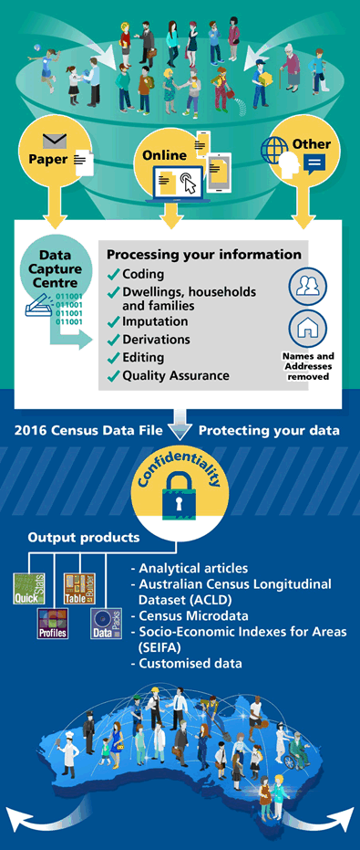
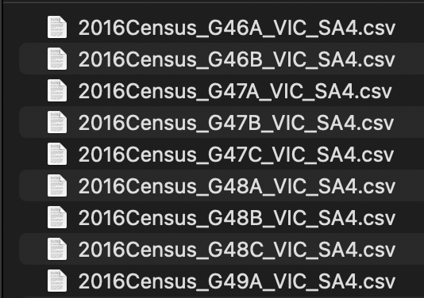

```{r setup, include=FALSE}
knitr::opts_chunk$set(fig.path = "Figures/", fig.align ="center",
                      out.width = "50%", echo = FALSE, 
                      messages = FALSE, 
                      warning = FALSE)
options(htmltools.dir.version = FALSE)
```

```{r , echo = FALSE, message = FALSE, warning = FALSE}
library(palmerpenguins)
library(datasets)
library(tidyverse)
library(readr)
library(kableExtra)
library(tinytex)
library(bookdown)
library(naniar)
library(visdat)
library(citation)
library(knitr)
library(scales)
library(patchwork)
library(sf)
library(glue)
library(unglue)
library(sugarbag)
library(readxl)
library(plotly)
library(tidytext)
library(polite)
library(rvest)
```


class: left, top
.pull-left[
```{r out.width = '35%', echo = FALSE, fig.align="center"}
knitr::include_graphics("figs/ABS_Logo_333.svg")
```
]

# Census 2016: 

### Tuesday 9th August

.content-box-neutral[ 
* "The Census of Population and Housing (Census) is Australia’s largest statistical collection undertaken by the Australian Bureau of Statistics ([ABS](https://www.abs.gov.au/websitedbs/censushome.nsf/home/2016))." 

* The Census aimed to accurately collect data on the key characteristics of people in Australia on Census night and the dwellings in which they lived in.
]
.content-box-duke-green[ 
* In 2016, the Census collected data for 10 million dwellings and approximately 24 million people, the largest number counted to date!!!
]


---
class: left, top
# Geographies

The 2016 Census data was output using the 2016 Australian Statistical Geography Standard (ASGS).The ABS Structures are a hierarchy of areas developed for the release of ABS statistical information. Their components are described below.

.pull-right1[
```{r out.height='50%', echo=TRUE, eval=FALSE}
t <- bow("https://www.abs.gov.au/websitedbs/D3310114.nsf/Home/2016%20QuickStats")
td <- scrape(t)
geographies <- html_table(td)[[2]] %>% select(Geography) 
knitr::kable(geographies, caption = "Geographies included in Census 2016") %>%
  kable_material(c("striped", "hover"))
```
]


.pull-left1[
```{r out.height='50%', eval=TRUE}
t <- bow("https://www.abs.gov.au/websitedbs/D3310114.nsf/Home/2016%20QuickStats")
td <- scrape(t)
geographies <- html_table(td)[[2]] %>% 
  select(Geography) 
knitr::kable(geographies) %>%
  kable_material(c("striped", "hover"))
```
]


---
class: left, middle
# Data Collection
.green[.bold[How was the Census data collected?]]
* Paper Forms

* Online Forms

---
class: left, top
# Data Collection
```{r}
t <- bow("https://www.abs.gov.au/ausstats/abs@.nsf/Lookup/by%20Subject/2900.0~2016~Main%20Features~How%20we%20collected%20your%20information~2")
td <- scrape(t)
responses <- html_table(td)[][3:4] 
responses_pvt <- responses[[1]] %>%
  rename(territory=X1,
         form=X2,
         `2006`=X3,
         `2011`=X4,
         `2016`=X5) 
responses_pvt <- responses_pvt[-1,]

territory <- responses_pvt %>%
  select(territory) %>%
  filter(territory != "") %>%
  mutate(form="Paper form")

responses_ppvt <- responses_pvt %>%
  filter(territory == "") %>%
    select(-territory) %>%
    right_join(territory)%>%
    filter(row_number() %in% c(1,11,21,31,41,51,61,71,81))

responses_pvt <- responses_pvt %>%
  filter(territory != "") %>%
  rbind(responses_ppvt) %>%
  mutate(dwelling = "private")

responses_ntpvt <- responses[[2]] %>%
  rename(territory=X1,
         form=X2,
         `2006`=X3,
         `2011`=X4,
         `2016`=X5) 
responses_ntpvt <- responses_ntpvt[-1,]

territory <- responses_ntpvt %>%
  select(territory) %>%
  filter(territory != "") %>%
  mutate(form="Paper form")

responses_pntpvt <- responses_ntpvt %>%
  filter(territory == "") %>%
    select(-territory) %>%
    right_join(territory)%>%
    filter(row_number() %in% c(1,11,21,31,41,51,61,71,81))

responses_ntpvt <- responses_ntpvt %>%
  filter(territory != "") %>%
  rbind(responses_pntpvt) %>%
  mutate(dwelling = "non-private")

responses <- responses_ntpvt %>%
  rbind(responses_pvt) %>%
  pivot_longer(cols = c(`2006`,`2011`,`2016`),
               names_to = "year",
               values_to = "percentage")
```

.pull-left1[
```{r echo=TRUE, eval=FALSE}
responses %>%
  ggplot() +
  geom_line(mapping = aes(
    x=year,
    y=percentage,
    colour=territory, 
    group=territory)) +
  facet_grid(form~dwelling) +
  labs(
    title = 
         "Time Series: Percentage of Online and Paper Forms") +
  theme_bw() +
  theme(axis.text.y = element_blank(), axis.ticks.y = element_blank()) 
  
```
]

.pull-right1[
```{r echo=FALSE, eval=TRUE}
responses %>%
  ggplot() +
  geom_line(mapping = aes(x=year,y=percentage,colour=territory, group=territory)) +
  facet_grid(form~dwelling) +
  labs(title = "Time Series: Percentage of Online and Paper Forms") +
  theme_bw() +
  theme(axis.text.y = element_blank(), axis.ticks.y = element_blank()) 
  
```
]

---
class:  center, top

.pull-left1[
```{r out.width = '50%', echo = FALSE}

```
]

.pull-right1[.green[.bold[[.green[ABS]:Turning your information into Census data](https://www.abs.gov.au/ausstats/abs@.nsf/Lookup/by%20Subject/2900.0~2016~Main%20Features~Turning%20your%20information%20into%20Census%20data~3)]]]


---
class: center, top

.pull-left[Sample Paper Form
.tiny[<span>by <a href="https://www.abs.gov.au/ausstats/abs@.nsf/0/d45601538d018a35ca257ea600148936/Body/0.3104!OpenElement&FieldElemFormat=gif">ABS</a> </span>]
```{r out.width = '50%', echo = FALSE}
knitr::include_graphics("https://www.abs.gov.au/ausstats/abs@.nsf/0/d45601538d018a35ca257ea600148936/Body/0.3104!OpenElement&FieldElemFormat=gif")
```
]

---
class: middle, middle

# what data is available?
---
class: left, top
# DataPacks 

.content-box-duke-green[ 
* [Datapacks](https://datapacks.censusdata.abs.gov.au/datapacks/) are provided in CSV format. 
* They include comprehensive data files and associated Geographic Information System [(GIS)](https://datapacks.censusdata.abs.gov.au/geopackages/) boundary files in a format suitable for loading into proprietary software and/or client custom-built systems.
]

.content-box-soft[ 
The .green[.bold[main Census characteristics]] for people, families and dwellings, such as .red[.bold[age, education, income, housing and employment]] are included.
]


---
class: left, top

### Our analysis will be based on these topics for Statistical Area 4

.content-box-soft[.blue[.bold[
Field of Study and Education Qualification
- G46: Non-School Qualification:  Level of Education by Age by Sex
- G47: Non-School Qualification:  Field of Study by Age by Sex
]]]
.content-box-soft[.blue[.bold[
Industry of Employment and Occupation by Hours of Work
- G51: Industry of Employment by Age by Sex
- G57: Occupation by Age by Sex
- G52: Industry of Employment by Hours Worked by Sex
- G58: Occupation by Hours Worked by Sex
]]]


Lets see the insights from these tables on
.tiny[<a href="///Users/mohammedfaizan/git/etc5513/etc5513-assignment-4-star-wars/presentation.html">Flexdashboard</a>]

---
class: left, top

# SA4 Boundaries of Victoria, Australia

```{r}
data_path <- here::here("data/australian_census_data_2016/")
```


```{r}
data_path <- here::here("data/australian_census_data_2016/")
census_paths <- glue::glue(data_path, "/2016 Census GCP All Geographies for VIC/SA4/VIC/2016Census_G{number}{alpha}_VIC_SA4.csv", 
                         number = c("46","46","47","47","47","51","51","51","51","57","57", "52", "52", "52", "52", "58", "58"), alpha = c("A","B","A","B","C","A","B","C","D","A","B", "A","B","C","D", "A","B"))
```
```{r geopath, include=FALSE}
geopath <- glue::glue(data_path, "/2016_SA4_shape/SA4_2016_AUST.shp")
sa4_codes<- read_csv(census_paths[2]) %>% 
                mutate(SA4_CODE_2016 = as.character(SA4_CODE_2016)) %>% 
                select(SA4_CODE_2016)
sa4_geomap <- read_sf(geopath) %>%
  right_join(sa4_codes, by=c("SA4_CODE16" = "SA4_CODE_2016"))
```


```{r}
ggplot(sa4_geomap) +
  geom_sf() +
  labs(title = "SA4 Boundaries of Victoria, Australia") +
  theme_void()
```


---
class: left, top

### A look into the tables

#### .red[DATA] not in .red[TIDY] format


```{r echo=TRUE}
g51 <- read.csv(census_paths[1])
g51%>%kable()
```

---
class: left, top

### A look into the tables

#### .red[Same Table] present in .red[different files]

.pull-left[
```{r , echo = FALSE, fig.align="center"}

```
]

---
class: left, top

# Cleaning


```{r echo=TRUE, eval=FALSE}
g51 <- map_dfr(census_paths[6:8], ~{
  df <- read_csv(.x) %>%
      select(-starts_with("P"), -contains("Tot")) %>%
            mutate(
              SA4_CODE_2016 = as.character(SA4_CODE_2016)) %>% 
  pivot_longer(cols = -c(SA4_CODE_2016),
                  names_to = "category",
                  values_to = "count") %>%
  unglue_unnest(category, 
                    c("{sex=[MF]}_{industry=(Ag_For_Fshg|Mining|Manufact|El_Gas_Wt_Waste|Constru|WhlesaleTde|RetTde|Accom_food|Trans_post_wrehsg|Info_media_teleco|Fin_Insur|RtnHir_REst|Pro_scien_tec|Admin_supp|Public_admin_sfty|Educ_trng|HlthCare_SocAs|Art_recn|Oth_scs|ID_NS)}_{age_min=\\d+}_{age_max=\\d+}",
                      "{sex=[MF]}_{industry=(Ag_For_Fshg|Mining|Manufact|El_Gas_Wt_Waste|Constru|WhlesaleTde|RetTde|Accom_food|Trans_post_wrehsg|Info_media_teleco|Fin_Insur|RtnHir_REst|Pro_scien_tec|Admin_supp|Public_admin_sfty|Educ_trng|HlthCare_SocAs|Art_recn|Oth_scs|ID_NS)}_{age_min=\\d+}ov"
                     ),
                remove = FALSE)
})
```
```{r }
g51 <- map_dfr(census_paths[6:8], ~{
  df <- read_csv(.x) %>%
      select(-starts_with("P"), -contains("Tot")) %>%
            mutate(SA4_CODE_2016 = as.character(SA4_CODE_2016)) %>% 
  pivot_longer(cols = -c(SA4_CODE_2016),
                  names_to = "category",
                  values_to = "count") %>%
  unglue_unnest(category, 
                    c("{sex=[MF]}_{industry=(Ag_For_Fshg|Mining|Manufact|El_Gas_Wt_Waste|Constru|WhlesaleTde|RetTde|Accom_food|Trans_post_wrehsg|Info_media_teleco|Fin_Insur|RtnHir_REst|Pro_scien_tec|Admin_supp|Public_admin_sfty|Educ_trng|HlthCare_SocAs|Art_recn|Oth_scs|ID_NS)}_{age_min=\\d+}_{age_max=\\d+}",
                      "{sex=[MF]}_{industry=(Ag_For_Fshg|Mining|Manufact|El_Gas_Wt_Waste|Constru|WhlesaleTde|RetTde|Accom_food|Trans_post_wrehsg|Info_media_teleco|Fin_Insur|RtnHir_REst|Pro_scien_tec|Admin_supp|Public_admin_sfty|Educ_trng|HlthCare_SocAs|Art_recn|Oth_scs|ID_NS)}_{age_min=\\d+}ov"
                     ),
                remove = FALSE)
})
```


---
class: left, top

# Renaming
```{r }
g51 <- g51 %>% 
  mutate(industry =case_when(
                            str_detect(industry, "Ag_For_Fshg") ~ "Agriculture_forestry_and_fishing",
                            str_detect(industry, "Manufact") ~ "Manufacturing",
                            str_detect(industry, "El_Gas_Wt_Waste") ~ "Electricity_gas_water_and_waste_service",
                            str_detect(industry, "Constru") ~ "Construction",
                            str_detect(industry, "Ag_Envir_Rltd_Sts") ~ "Agriculture_Environment",
                            str_detect(industry, "WhlesaleTde") ~ "Wholesale_trade",
                            str_detect(industry, "RetTde") ~ "Retail_trade",
                            str_detect(industry, "Accom_food") ~ "Accommodation_and_food_services",
                            str_detect(industry, "Trans_post_wrehsg") ~ "Transport_postal_and_warehousing",
                            str_detect(industry, "Info_media_teleco") ~ "Information_media_and_telecommunications",
                            str_detect(industry, "Fin_Insur") ~ "Financial_and_insurance_services",
                            str_detect(industry, "RtnHir_REst") ~ "Rental_hiring_and_real_estate_services",
                            str_detect(industry, "Pro_scien_tec") ~ "Professional_scientific_and_technical_services",
                            str_detect(industry, "Admin_supp") ~ "Administrative_and_support_services",
                            str_detect(industry, "Public_admin_sfty") ~ "Public_administration_and_safety",
                            str_detect(industry, "Educ_trng") ~ "Education_and_training",
                            str_detect(industry, "HlthCare_SocAs") ~ "Health_care_and_social_assistance",
                            str_detect(industry, "Art_recn") ~ "Arts_and_recreation_services",
                            str_detect(industry, "Oth_scs") ~ "Other_services",
                            str_detect(industry, "ID_NS") ~ "Not Stated",
                            TRUE ~ industry))  %>%
  select(-category) %>%
  rename(count_industry = count)
```
```{r echo=TRUE, eval=FALSE}
g51 <- g51 %>% 
  mutate(industry =case_when(
str_detect(industry, "Ag_For_Fshg") ~ "Agriculture_forestry_and_fishing",
str_detect(industry, "Manufact") ~ "Manufacturing",
str_detect(industry, "El_Gas_Wt_Waste") ~ "Electricity_gas_water_and_waste_service",
str_detect(industry, "Constru") ~ "Construction",
str_detect(industry, "Ag_Envir_Rltd_Sts") ~ "Agriculture_Environment",
str_detect(industry, "WhlesaleTde") ~ "Wholesale_trade",
str_detect(industry, "RetTde") ~ "Retail_trade",
str_detect(industry, "Accom_food") ~ "Accommodation_and_food_services",
str_detect(industry, "Trans_post_wrehsg") ~ "Transport_postal_and_warehousing",
str_detect(industry, "Info_media_teleco") ~ "Information_media_and_telecommunications",
str_detect(industry, "Fin_Insur") ~ "Financial_and_insurance_services",
str_detect(industry, "RtnHir_REst") ~ "Rental_hiring_and_real_estate_services",
str_detect(industry, "Pro_scien_tec") ~ "Professional_scientific_and_technical_services",
str_detect(industry, "Admin_supp") ~ "Administrative_and_support_services",
str_detect(industry, "Public_admin_sfty") ~ "Public_administration_and_safety",
str_detect(industry, "Educ_trng") ~ "Education_and_training",
str_detect(industry, "HlthCare_SocAs") ~ "Health_care_and_social_assistance",
str_detect(industry, "Art_recn") ~ "Arts_and_recreation_services",
str_detect(industry, "Oth_scs") ~ "Other_services",
str_detect(industry, "ID_NS") ~ "Not Stated",
TRUE ~ industry))  %>%
  select(-category) %>%
  rename(count_industry = count)
```

---
class: left, top

# Cleaned Table

```{r echo = TRUE}
g51 %>% head() %>% kable() %>%
  kable_styling(latex_options = c("scale_down", "hold_position"))
```

---
class: left, top

Lets see the insights from these tables on
.tiny[<a href="///Users/mohammedfaizan/git/etc5513/etc5513-assignment-4-star-wars/presentation.html">Flexdashboard</a>]
